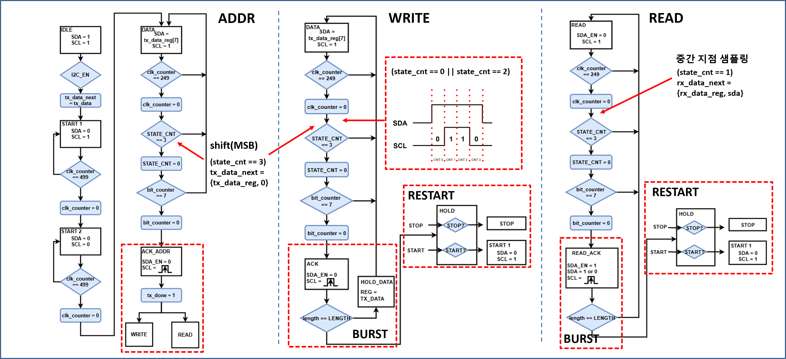

# I2C Master / Slave IP (SystemVerilog)

FPGA/ASIC 학습용으로 작성한 I2C Master + I2C Slave RTL 입니다.  
I2C 기본 규칙(START/STOP, ACK/NACK, 7-bit address, repeated START 등)을 구현하고,
Burst 전송(Length 기반) 흐름을 상태머신으로 정리했습니다.

> ⚠️ Note  
> 실제 I2C 버스는 **open-drain + pull-up 저항** 구조가 기본입니다.  
> 본 구현은 학습/시뮬레이션 편의상 일부 구간에서 SDA를 '1'로 **직접 구동**하는 단순화가 포함되어 있습니다.  
> (README 하단 “Known Limitations / TODO” 참고)

---

## 1. I2C Protocol Quick Summary (Spec 기반)

- **2-Wire**: SDA(Data), SCL(Clock) 두 선으로 통신
- **START/STOP**
  - START: SCL=HIGH 동안 SDA가 HIGH→LOW로 떨어질 때
  - STOP : SCL=HIGH 동안 SDA가 LOW→HIGH로 올라갈 때
- **Data Valid Rule**
  - 일반 데이터 비트는 **SCL=HIGH 구간에서 SDA가 안정(stable)** 해야 함
  - SDA 변화는 **SCL=LOW 구간**에서만 허용 (단, START/STOP 예외)
- **Byte + ACK**
  - 8비트 전송 후 9번째 클록에서 ACK/NACK
  - ACK = SDA LOW, NACK = SDA HIGH
- **Clock Stretching (Optional)**
  - Target(Slave)가 SCL을 LOW로 잡아 전송을 잠시 멈추는 기능 (본 구현은 미지원)

---

## 2. Repository Structure


> 위 docs 이미지는 PPT에 있는 그림을 그대로 넣어서 README에 임베드하면 포트폴리오 가독성이 확 올라갑니다.

---

## 3. Block Diagram (Single Master + Multi Target Concept)


---

## 4. Timing Overview


핵심 규칙:
- START/STOP은 SCL=HIGH 구간에서 SDA 변화를 사용
- 데이터 비트는 SCL=HIGH 구간에서 샘플링(안정 구간)  
- ACK/NACK는 9th clock에서 SDA로 판단

---

## 5. I2C_MASTER.sv

### 5.1 Interface (Ports)

| Port | Dir | Width | Description |
|------|-----|-------|-------------|
| clk | in | 1 | 내부 동작 클록 |
| resetn | in | 1 | Active-low reset |
| I2C_En | in | 1 | 트랜잭션 시작(enable) |
| addr | in | 7 | 7-bit target address |
| CR_RW | in | 1 | 0=WRITE, 1=READ |
| tx_data | in | 8 | WRITE 시 송신 데이터(바이트) |
| length | in | D_LENGTH | 데이터 바이트 개수(N) |
| I2C_start | in | 1 | (HOLD/HOLD2에서) repeated START 또는 다음 바이트 진행 트리거 |
| I2C_stop | in | 1 | (HOLD에서) STOP 생성 트리거 |
| tx_done | out | 1 | WRITE 바이트 전송 완료 펄스 |
| tx_ready | out | 1 | IDLE에서 1 (시작 가능) |
| rx_data | out | 8 | READ로 수신한 바이트 |
| rx_done | out | 1 | READ 바이트 수신 완료 펄스 |
| SCL | out | 1 | I2C clock line |
| SDA | inout | 1 | I2C data line (tri-state 지원) |

### 5.2 Master State Machine (High-level)



구현된 흐름(요약):
- `IDLE` → `START1/START2` : START 조건 생성
- `ADDR(=WRITE 상태에서 첫 바이트)` : `{addr, CR_RW}` 전송
- `ACK` : address ACK 판단 후 READ/WRITE 분기
- WRITE:
  - `HOLD2`에서 tx_data 갱신 + I2C_start로 다음 바이트 송신
  - 바이트마다 `WRITE_ACK`에서 ACK 체크
- READ:
  - `READ`에서 SDA 샘플링하여 `rx_data` 구성
  - `READ_ACK`에서 남은 length에 따라 ACK(계속) / NACK(마지막) 처리
- `HOLD`:
  - `I2C_stop`이면 STOP 생성
  - `I2C_start`이면 repeated START로 재시작(주소부터 다시)

### 5.3 Burst Length 동작 정의 (중요)

- `length = N` : **데이터 바이트 N개** 전송/수신을 의미
- 주소 전송 후 ACK가 성공하면 내부 length 카운터가 진행되며,
  - WRITE: N개의 바이트를 순차 송신 (각 바이트 후 ACK 체크)
  - READ : N개의 바이트를 순차 수신 (마지막 바이트에서 NACK)

> ✅ Tip  
> WRITE의 경우 “마지막 바이트 전송 후”에는 `HOLD`로 들어가므로, 최종적으로 `I2C_stop`을 넣어 STOP을 만들어 마무리하는 구조입니다.

### 5.4 사용 예시 (Testbench top 연결)

```systemverilog
module tb;
  logic clk, resetn;

  logic        I2C_En, CR_RW, I2C_start, I2C_stop;
  logic [6:0]  addr;
  logic [7:0]  tx_data;
  logic [1:0]  length;

  logic        tx_done, tx_ready, rx_done;
  logic [7:0]  rx_data;

  logic scl;
  tri   sda;
  pullup(sda); // 실제 I2C처럼 풀업을 모델링(권장)

  I2C_MASTER #(.D_LENGTH(2)) u_m (
    .clk, .resetn,
    .I2C_En, .addr, .CR_RW,
    .tx_data, .tx_done, .tx_ready,
    .rx_data, .rx_done,
    .I2C_start, .I2C_stop, .length,
    .SCL(scl), .SDA(sda)
  );

  // 필요 시 슬레이브도 같이 연결:
  I2C_SLAVE u_s (
    .clk, .resetn,
    .tx_data(8'hA5), .tx_done(), .tx_ready(), // tx_ready는 현재 미사용(See TODO)
    .rx_data(), .rx_done(),
    .scl(scl), .sda(sda)
  );

endmodule

